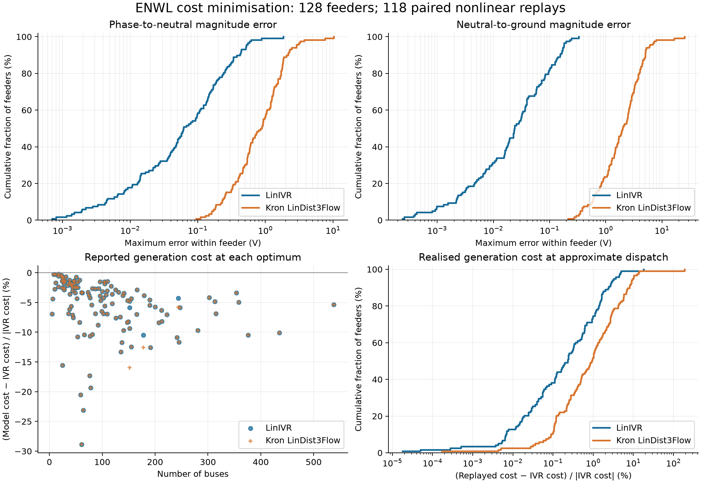

# ENWL generation-cost comparison — 30 September 2026

The panel covers all **128 JSON networks**, from **5 to 538 buses**, in the supplied ENWL `reduced` directory. These files have previously reduced topology but retain four-wire conductors. LinIVR and the nonlinear reference retain those conductors. Only LinDist3Flow applies an additional neutral Kron projection.

## Comparable economic problem

The supplied files contain a priced `generator.grid` at the source bus alongside an independent unpriced ideal voltage source. As written, the optimizer can drive that generator to its negative P limit while the voltage source supplies free power. This gives an artificial export credit. The as-supplied audit below retains that behavior; it is not used to claim useful cost accuracy.

For the main panel, copies of each network transfer the grid generator's cost and active-power bounds to the voltage source and remove the duplicate generator. All DER prices and active bounds are retained; no source-import objective or uniform replacement tariff is substituted. Export is credited at the original grid tariff. Reactive bounds are absent in these files and remain absent: Q is unpriced and otherwise unbounded by device capability. LinDist3Flow's input validation was extended to accept that same contract.

All three solvers receive identical prices, uniformly divided by the case's maximum tariff for numerical conditioning. Every reported cost is independently recomputed from original coefficients as Σ cₖPₖ/1000 (currency/hour). This positive objective scaling does not change the mathematical optimizer. Source files are never edited. The raw observations record hashes, transformations, numerical settings and dependency revisions.

LinDist3Flow uses source-propagated reference phasors and its permissive, audited Kron projection. The only reported model-change codes are ideal-neutral grounding and removal of neutral-conductor current ratings. Phase ratings and phase-to-neutral voltage bounds are retained. Its reported neutral voltage is the imposed zero-ground assumption; it has no neutral-voltage state. No loaded AC solution enters either approximate model.

## Solve and replay outcomes

Nonlinear IVR statuses: `{'LOCALLY_SOLVED': 127, 'LOCALLY_INFEASIBLE': 1}`. Reference checker outcomes: `{'checks_passed': 127, 'not assessed': 1}`. Ipopt gives local candidates, not global optimality certificates.

| Model | Optimisation status counts | Four-wire replay status counts |
|:--|:--|:--|
| LinIVR | {'OPTIMAL': 127, 'INFEASIBLE': 1} | {'LOCALLY_SOLVED': 126, 'LOCALLY_INFEASIBLE': 1, 'not run': 1} |
| Kron LinDist3Flow | {'OPTIMAL': 127, 'INFEASIBLE': 1} | {'LOCALLY_SOLVED': 119, 'ALMOST_LOCALLY_SOLVED': 7, 'LOCALLY_INFEASIBLE': 1, 'not run': 1} |

Replay fixes every non-slack generator's active **and reactive** power. The original four-wire nonlinear circuit then determines the slack injection and its losses; source box constraints remain enforced. A local-infeasibility status is not a proof that the fixed dispatch has no AC solution. Near-converged results are excluded, not silently promoted to accepted solutions.

The paired replay statistics below use the same **118 feeders** for both approximations. Voltage violations use a 0.0001 V reporting threshold. The BMOPFTools solution checker explicitly leaves some dimensions unassessed, including full device-equation/KCL verification and complete limit coverage; a passed checker is not a comprehensive feasibility certificate.

- LinIVR: accepted-replay checker outcomes `{'checks_passed': 126}`; 0 accepted replays exceed phase-to-neutral limits; maximum fixed-DER dispatch residual 1.9156e-06 VA.
- Kron LinDist3Flow: accepted-replay checker outcomes `{'checks_passed': 116, 'failed': 3}`; 2 accepted replays exceed phase-to-neutral limits; maximum fixed-DER dispatch residual 3.1704e-07 VA.

## Voltage accuracy

Magnitude error means | |Vφ−Vn|model − |Vφ−Vn|AC | for phase-to-neutral voltage and | |Vn|model − |Vn|AC | for neutral-to-ground voltage. The table summarizes each feeder's maximum error; RMSE pools individual bus/channel observations. LinIVR's complex-phasor errors are also retained in the raw data. LinDist3Flow's reference angles are not treated as solved phase angles.

### Approximation error at its own fixed dispatch

| Model | Quantity | Median feeder max (V) | 95th percentile (V) | Worst (V) | Pooled RMSE (V) |
|:--|:--|--:|--:|--:|--:|
| LinIVR | phase-to-neutral | 0.061474 | 0.51778 | 1.8563 | 0.16643 |
| LinIVR | neutral-to-ground | 0.023723 | 0.17985 | 0.33341 | 0.0588 |
| Kron LinDist3Flow | phase-to-neutral | 0.86585 | 2.8746 | 10.276 | 1.2121 |
| Kron LinDist3Flow | neutral-to-ground | 2.002 | 5.9688 | 25.113 | 3.771 |

LinIVR has the smaller maximum phase-to-neutral error on **118/118** paired replays. The zero-neutral error for Kron LinDist3Flow equals the actual neutral displacement at its dispatch; this measures omitted physics, not a solved neutral estimate.

### Difference between independently optimised states

| Model | Quantity | Median feeder max (V) | 95th percentile (V) | Worst (V) |
|:--|:--|--:|--:|--:|
| LinIVR | phase-to-neutral | 0.57544 | 4.921 | 11.049 |
| LinIVR | neutral-to-ground | 0.40868 | 2.5126 | 7.0522 |
| Kron LinDist3Flow | phase-to-neutral | 1.2823 | 7.3947 | 18.283 |
| Kron LinDist3Flow | neutral-to-ground | 1.6564 | 4.4781 | 12.605 |

This second table includes dispatch differences as well as voltage-model error. The approximations' first-order cost does not price incremental losses, leaving flat directions in Q; nonlinear IVR can select reactive dispatch that reduces resistive losses. Thus there need not be a unique voltage profile associated with an approximate economic optimum.

## Objective accuracy

All percentages use 100 × (candidate cost − nonlinear-IVR cost) / |nonlinear-IVR cost|. Negative reported-cost differences mean optimistic model objectives; they are not relaxation bounds. Replayed cost includes the nonlinear slack injection at the approximate DER dispatch. Near-zero reference costs are excluded from percentage statistics, with the count recorded in the summary.

| Model / evaluation | Median difference (%) | 95th percentile (%) | Minimum (%) | Maximum (%) |
|:--|--:|--:|--:|--:|
| LinIVR / reported optimum | -4.2029 | -0.67232 | -28.849 | -0.23407 |
| LinIVR / nonlinear replay | 0.23215 | 3.3246 | 1.8059e-05 | 18.023 |
| Kron LinDist3Flow / reported optimum | -4.2029 | -0.67232 | -28.849 | -0.23407 |
| Kron LinDist3Flow / nonlinear replay | 0.93439 | 9.6431 | 0.00017067 | 187.47 |

The approximate objectives agree within 10⁻⁸ currency/hour on **124/127** jointly solved cases. The largest difference is **0.0011962 currency/hour**. Both largely omit incremental loss costs, but their feasible dispatch regions differ because of voltage and neutral-current constraints. Near-equal objectives do not imply near-equal voltages or equally good AC dispatch. Independently reconstructed objectives agree with solver objectives within 1.5613e-16 currency/hour.

LinIVR gives lower replayed cost on **115/118** paired cases. This is observed performance of the selected solver optima, not a guarantee: unpriced reactive dispatch can change with solver tie-breaking. A positive replay cost difference is relative to the locally solved IVR reference, not a certified global optimality gap.

Among the **115 paired replays passing the assessed operational checks**, LinIVR's median/worst replay cost difference is 0.19467% / 4.7912%; LinDist3Flow's is 0.84459% / 14.064%. The broader statistics above deliberately retain converged replays that violate limits; such costs are not feasible-dispatch performance claims.

## As-supplied economic audit

| Case | Buses | Four-wire IVR cost/h | LinIVR cost/h | Kron LinDist3Flow cost/h |
|:--|--:|--:|--:|--:|
| network_23_Feeder_3.json | 5 | -0.0063657 | -0.0063657 | -0.0063657 |
| network_15_Feeder_5.json | 44 | -0.10621 | -0.10621 | -0.10621 |
| network_5_Feeder_8.json | 81 | -0.16565 | -0.16565 | -0.16565 |
| network_19_Feeder_5.json | 148 | -0.36153 | -0.36153 | -0.36153 |
| Network_8_Feeder_2.json | 538 | -1.4709 | -1.4717 | -1.4714 |

These very close, typically negative costs are dominated by the duplicate grid device's artificial export credit. They should not be interpreted as validation of the lossless economic models.

## Non-accepted replays

| Model | Case | Status |
|:--|:--|:--|
| LinIVR | network_10_Feeder_3.json | LOCALLY_INFEASIBLE |
| LinIVR | network_17_Feeder_7.json | not run |
| Kron LinDist3Flow | network_9_Feeder_4.json | ALMOST_LOCALLY_SOLVED |
| Kron LinDist3Flow | network_2_Feeder_5.json | ALMOST_LOCALLY_SOLVED |
| Kron LinDist3Flow | network_22_Feeder_1.json | LOCALLY_INFEASIBLE |
| Kron LinDist3Flow | network_13_Feeder_2.json | ALMOST_LOCALLY_SOLVED |
| Kron LinDist3Flow | network_15_Feeder_7.json | ALMOST_LOCALLY_SOLVED |
| Kron LinDist3Flow | network_19_Feeder_5.json | ALMOST_LOCALLY_SOLVED |
| Kron LinDist3Flow | network_23_Feeder_1.json | ALMOST_LOCALLY_SOLVED |
| Kron LinDist3Flow | network_17_Feeder_7.json | not run |
| Kron LinDist3Flow | network_9_Feeder_5.json | ALMOST_LOCALLY_SOLVED |

### Converged replays with assessed limit violations

| Model | Case | Maximum Vpn violation (V) | Error codes and counts |
|:--|:--|--:|:--|
| Kron LinDist3Flow | network_12_Feeder_3.json | 9.9507 | {'E.SOL.VOLT_VIOLATION': 217, 'E.SOL.THERMAL_VIOLATION': 52} |
| Kron LinDist3Flow | network_13_Feeder_4.json | 7.6384 | {'E.SOL.VOLT_VIOLATION': 145, 'E.SOL.THERMAL_VIOLATION': 2} |
| Kron LinDist3Flow | network_2_Feeder_3.json | 0 | {'E.SOL.THERMAL_VIOLATION': 2} |

## Per-feeder results

Costs are currency/hour. Voltage columns are maximum phase-to-neutral magnitude errors against each model's own nonlinear replay. A dash means that replay was not accepted.

| Case | Buses | IVR cost/h | LinIVR cost/h | L3F cost/h | LinIVR replay Δcost (%) | L3F replay Δcost (%) | LinIVR ΔV (V) | L3F ΔV (V) |
|:--|--:|--:|--:|--:|--:|--:|--:|--:|
| network_23_Feeder_3.json | 5 | 0.00013735 | 0.00012784 | 0.00012784 | 0.0054849 | 0.00017067 | 0.0044405 | 0.30952 |
| network_13_Feeder_3.json | 6 | 6.8503e-05 | 6.5485e-05 | 6.5485e-05 | 0.0052802 | 0.088864 | 0.0018984 | 0.14565 |
| network_11_Feeder_2.json | 8 | 0.00078823 | 0.0007863 | 0.0007863 | 0.0005075 | 0.10954 | 0.0019415 | 0.31256 |
| network_10_Feeder_2.json | 10 | 0.0016849 | 0.0016382 | 0.0016382 | 4.9696e-05 | 0.10541 | 0.025997 | 1.0089 |
| network_5_Feeder_1.json | 11 | 0.0010483 | 0.0010456 | 0.0010456 | 1.8059e-05 | 0.0050413 | 0.0022051 | 0.18284 |
| network_10_Feeder_6.json | 12 | 0.0010957 | 0.0010775 | 0.0010775 | 0.068598 | 0.50566 | 0.0065771 | 0.23101 |
| network_10_Feeder_4.json | 17 | 0.0028396 | 0.0028234 | 0.0028234 | 0.0067143 | 0.13608 | 0.00442 | 0.36233 |
| network_10_Feeder_5.json | 17 | 0.0028422 | 0.0027749 | 0.0027749 | 0.017059 | 0.21481 | 0.012747 | 0.5349 |
| network_17_Feeder_2.json | 17 | 0.0046433 | 0.0046325 | 0.0046325 | 0.00027437 | 0.0043102 | 0.0033181 | 0.17098 |
| network_9_Feeder_3.json | 23 | 0.0041981 | 0.0041805 | 0.0041805 | 0.0043096 | 0.035672 | 0.00069943 | 0.094779 |
| network_25_Feeder_1.json | 24 | 0.0035094 | 0.0034862 | 0.0034862 | 0.0037456 | 0.044267 | 0.004638 | 0.2179 |
| network_9_Feeder_2.json | 24 | 0.0048283 | 0.0047611 | 0.0047611 | 0.043419 | 0.25069 | 0.0042089 | 0.18568 |
| network_9_Feeder_4.json | 24 | 0.002197 | 0.0021413 | 0.0021413 | 0.072528 | — | 0.0042093 | — |
| network_10_Feeder_1.json | 25 | 0.00057682 | 0.00048724 | 0.00048724 | 0.24389 | 0.55747 | 0.013252 | 0.53975 |
| network_20_Feeder_5.json | 25 | 0.0044327 | 0.0044017 | 0.0044017 | 0.0076914 | 0.031196 | 0.0011394 | 0.16009 |
| network_9_Feeder_6.json | 26 | 0.0035481 | 0.0035133 | 0.0035133 | 0.016628 | 0.1133 | 0.0014952 | 0.12971 |
| network_20_Feeder_1.json | 27 | 0.0023508 | 0.0023089 | 0.0023089 | 0.019061 | 0.11899 | 0.0013605 | 0.16102 |
| network_22_Feeder_2.json | 28 | 0.0026073 | 0.0025406 | 0.0025406 | 0.0069954 | 0.11864 | 0.013943 | 0.26107 |
| network_25_Feeder_3.json | 28 | 0.0034396 | 0.0033904 | 0.0033904 | 0.0063256 | 0.21575 | 0.0086082 | 0.18216 |
| network_7_Feeder_6.json | 28 | 0.002104 | 0.0020436 | 0.0020436 | 0.028963 | 0.27188 | 0.0079512 | 0.35762 |
| Network_14_Feeder_2.json | 30 | 0.0039001 | 0.0038447 | 0.0038447 | 0.014692 | 0.1066 | 0.0028046 | 0.32406 |
| network_20_Feeder_4.json | 31 | 0.0040765 | 0.00405 | 0.00405 | 0.011527 | 0.066508 | 0.00080548 | 0.10905 |
| network_4_Feeder_2.json | 35 | 0.0037529 | 0.0036738 | 0.0036738 | 0.01194 | 0.35585 | 0.014486 | 0.40452 |
| network_5_Feeder_6.json | 36 | 0.0032707 | 0.0030469 | 0.0030469 | 0.19467 | 0.51958 | 0.052127 | 0.92101 |
| network_10_Feeder_3.json | 38 | 0.0042171 | 0.0041654 | 0.0041654 | — | 1.4684 | — | 0.58605 |
| network_7_Feeder_7.json | 38 | 0.0022507 | 0.0021121 | 0.0021121 | 0.05661 | 0.5085 | 0.038135 | 0.58927 |
| network_25_Feeder_2.json | 39 | 0.0040226 | 0.0039545 | 0.0039545 | 0.0065253 | 0.027608 | 0.00646 | 0.25438 |
| network_4_Feeder_3.json | 39 | 0.0036061 | 0.0034767 | 0.0034767 | 0.15988 | 0.21998 | 0.054714 | 0.6581 |
| network_5_Feeder_2.json | 39 | 0.0040848 | 0.004014 | 0.004014 | 0.017734 | 0.056731 | 0.035872 | 0.64488 |
| network_11_Feeder_1.json | 41 | 0.0022547 | 0.0021274 | 0.0021274 | 0.31507 | 2.1839 | 0.021713 | 0.69832 |
| network_21_Feeder_4.json | 41 | 0.0023409 | 0.0022941 | 0.0022941 | 0.0063847 | 0.10702 | 0.0058048 | 0.23643 |
| network_3_Feeder_5.json | 43 | 0.003648 | 0.0035715 | 0.0035715 | 0.12482 | 0.47678 | 0.059363 | 1.1416 |
| network_15_Feeder_5.json | 44 | 0.00323 | 0.0030017 | 0.0030017 | 0.99452 | 1.2183 | 0.073602 | 0.93462 |
| network_18_Feeder_8.json | 44 | 0.0034583 | 0.0033539 | 0.0033539 | 0.11646 | 0.40119 | 0.021889 | 0.59863 |
| network_4_Feeder_5.json | 44 | 0.0057015 | 0.0055636 | 0.0055636 | 0.12101 | 0.14312 | 0.035107 | 0.58507 |
| network_18_Feeder_6.json | 45 | 0.0024346 | 0.0022503 | 0.0022503 | 0.059128 | 0.4939 | 0.023345 | 0.48195 |
| Network_14_Feeder_6.json | 46 | 0.010217 | 0.010072 | 0.010072 | 0.013589 | 0.1065 | 0.01416 | 0.46496 |
| Network_14_Feeder_5.json | 47 | 0.010008 | 0.0098736 | 0.0098736 | 0.015198 | 0.11893 | 0.016812 | 0.55444 |
| network_5_Feeder_7.json | 47 | 0.0043022 | 0.0042249 | 0.0042249 | 0.054957 | 0.12195 | 0.013974 | 0.46413 |
| network_21_Feeder_1.json | 49 | 0.0035584 | 0.0034674 | 0.0034674 | 0.039311 | 0.79147 | 0.010751 | 0.25363 |
| network_21_Feeder_2.json | 49 | 0.0037208 | 0.0035947 | 0.0035947 | 0.030686 | 0.23777 | 0.010621 | 0.4245 |
| network_20_Feeder_2.json | 50 | 0.0042633 | 0.0041621 | 0.0041621 | 0.10929 | 0.193 | 0.013703 | 0.46029 |
| network_2_Feeder_5.json | 51 | 0.005005 | 0.0049686 | 0.0049686 | 0.15491 | — | 0.010161 | — |
| network_18_Feeder_2.json | 52 | 0.0046876 | 0.0044856 | 0.0044856 | 0.024458 | 0.32824 | 0.083521 | 0.79046 |
| network_11_Feeder_3.json | 53 | -0.0022718 | -0.0025167 | -0.0025167 | 1.1563 | 14.064 | 0.096988 | 1.5383 |
| network_4_Feeder_1.json | 53 | 0.0038475 | 0.0037846 | 0.0037846 | 0.029001 | 0.10111 | 0.0091484 | 0.24797 |
| network_22_Feeder_4.json | 54 | 0.0055129 | 0.0053766 | 0.0053766 | 0.11113 | 0.43386 | 0.0432 | 0.39633 |
| network_18_Feeder_7.json | 57 | 0.0041742 | 0.0041239 | 0.0041239 | 0.027697 | 0.077751 | 0.0082091 | 0.22857 |
| network_4_Feeder_6.json | 57 | 0.0029064 | 0.0026645 | 0.0026645 | 1.1931 | 1.7191 | 0.11114 | 0.57881 |
| network_22_Feeder_1.json | 59 | 0.00088497 | 0.00070313 | 0.00070313 | 0.35857 | — | 0.039859 | — |
| network_21_Feeder_5.json | 61 | 0.0033977 | 0.0032853 | 0.0032853 | 0.024649 | 0.69414 | 0.018923 | 0.54454 |
| network_22_Feeder_5.json | 61 | 0.0010934 | 0.00077797 | 0.00077797 | 4.4454 | 5.7697 | 0.14934 | 0.88448 |
| Network_14_Feeder_3.json | 62 | 0.0088388 | 0.0085427 | 0.0085427 | 0.055253 | 0.0971 | 0.067609 | 1.0318 |
| network_5_Feeder_4.json | 64 | 0.0025009 | 0.0019234 | 0.0019234 | 2.3412 | 2.6631 | 0.44394 | 1.7062 |
| network_1_Feeder_2.json | 66 | 0.0016241 | 0.0014551 | 0.0014551 | 0.92669 | 2.7417 | 0.060431 | 0.52949 |
| network_18_Feeder_4.json | 73 | 0.0037892 | 0.0036653 | 0.0036653 | 0.042893 | 0.48833 | 0.038987 | 0.32403 |
| network_16_Feeder_1.json | 75 | 0.011597 | 0.011161 | 0.011161 | 0.036283 | 0.34415 | 0.16844 | 1.5299 |
| network_13_Feeder_2.json | 76 | 0.0013753 | 0.0011377 | 0.0011377 | 0.71574 | — | 0.047919 | — |
| network_13_Feeder_1.json | 77 | 0.012858 | 0.012318 | 0.012318 | 0.3265 | 3.1036 | 0.227 | 1.1939 |
| network_22_Feeder_6.json | 77 | 0.0030301 | 0.0027082 | 0.0027082 | 0.24172 | 1.0807 | 0.14104 | 0.99751 |
| network_3_Feeder_4.json | 78 | 0.0026171 | 0.0021107 | 0.0021107 | 2.6986 | 2.4437 | 0.27462 | 1.6519 |
| network_1_Feeder_3.json | 80 | 0.011823 | 0.011182 | 0.011182 | 1.4786 | 3.0051 | 0.51692 | 2.8736 |
| network_23_Feeder_5.json | 81 | 0.0090569 | 0.0088187 | 0.0088187 | 0.17656 | 1.4208 | 0.057028 | 1.1988 |
| network_5_Feeder_8.json | 81 | 0.0022859 | 0.0020493 | 0.0020493 | 0.54719 | 1.0285 | 0.037167 | 0.60697 |
| network_18_Feeder_5.json | 87 | 0.0062653 | 0.0058355 | 0.0058355 | 0.055272 | 0.2775 | 0.17886 | 1.0549 |
| network_6_Feeder_2.json | 87 | 0.011461 | 0.011151 | 0.011151 | 0.090826 | 0.61816 | 0.048838 | 0.92832 |
| network_20_Feeder_3.json | 92 | 0.0047028 | 0.0042889 | 0.0042889 | 0.049549 | 0.40884 | 0.061678 | 1.3517 |
| network_15_Feeder_7.json | 93 | 0.012224 | 0.011899 | 0.011899 | 0.11748 | — | 0.066916 | — |
| Network_24_Feeder_1.json | 96 | 0.014473 | 0.014253 | 0.014253 | 0.11051 | 1.0339 | 0.04164 | 0.50074 |
| network_18_Feeder_9.json | 96 | 0.013076 | 0.012567 | 0.012567 | 0.18993 | 0.94871 | 0.13301 | 0.46955 |
| network_23_Feeder_2.json | 97 | 0.016206 | 0.015452 | 0.015452 | 0.12116 | 0.37624 | 0.4375 | 2.2966 |
| network_22_Feeder_3.json | 99 | 0.01204 | 0.011258 | 0.011258 | 1.6006 | 6.7996 | 0.33521 | 1.8674 |
| network_11_Feeder_4.json | 100 | 0.0087546 | 0.0084799 | 0.0084799 | 0.30431 | 2.3654 | 0.026599 | 0.64213 |
| network_3_Feeder_6.json | 102 | 0.010216 | 0.0095138 | 0.0095138 | 0.32092 | 0.66071 | 0.10681 | 1.7826 |
| network_5_Feeder_5.json | 102 | 0.012035 | 0.011527 | 0.011527 | 0.2407 | 0.27743 | 0.09881 | 1.4812 |
| network_7_Feeder_3.json | 104 | 0.01433 | 0.014116 | 0.014116 | 0.16689 | 0.76921 | 0.039493 | 0.33346 |
| Network_8_Feeder_1.json | 105 | 0.011318 | 0.01111 | 0.01111 | 0.23061 | 0.84459 | 0.056875 | 0.41205 |
| network_18_Feeder_1.json | 105 | 0.010782 | 0.010181 | 0.010181 | 0.51128 | 2.6826 | 0.13172 | 1.2308 |
| Network_14_Feeder_4.json | 107 | 0.014238 | 0.013713 | 0.013713 | 0.61052 | 1.1275 | 0.061271 | 0.74466 |
| network_18_Feeder_3.json | 109 | 0.014563 | 0.014123 | 0.014123 | 0.28595 | 1.7696 | 0.10453 | 0.71084 |
| network_19_Feeder_1.json | 109 | 0.012798 | 0.011908 | 0.011908 | 1.7934 | 2.1467 | 0.25406 | 1.3063 |
| network_19_Feeder_4.json | 110 | 0.011812 | 0.011643 | 0.011643 | 0.064738 | 0.92007 | 0.027842 | 0.59991 |
| network_1_Feeder_1.json | 117 | 0.010527 | 0.010293 | 0.010293 | 0.079906 | 0.24738 | 0.047169 | 0.55072 |
| network_15_Feeder_6.json | 119 | 0.013115 | 0.012439 | 0.012439 | 0.16182 | 1.5624 | 0.15933 | 1.1895 |
| network_7_Feeder_2.json | 119 | 0.010808 | 0.010419 | 0.010419 | 0.60045 | 2.003 | 0.12217 | 1.3007 |
| network_7_Feeder_5.json | 125 | 0.0074553 | 0.0072432 | 0.0072432 | 0.006975 | 0.086943 | 0.050572 | 0.39503 |
| network_16_Feeder_4.json | 126 | 0.0082099 | 0.0075867 | 0.0075867 | 0.9374 | 2.6018 | 0.14446 | 0.57463 |
| network_21_Feeder_3.json | 131 | 0.010647 | 0.010299 | 0.010299 | 0.03993 | 0.22346 | 0.048185 | 0.53683 |
| Network_14_Feeder_1.json | 134 | 0.010005 | 0.0092592 | 0.0092592 | 2.4161 | 7.1483 | 0.23212 | 1.8003 |
| network_7_Feeder_1.json | 135 | 0.0093243 | 0.0080819 | 0.0080819 | 3.6665 | 9.0121 | 0.52265 | 2.0585 |
| network_19_Feeder_3.json | 137 | 0.008336 | 0.0073591 | 0.0073591 | 2.8348 | 10.38 | 0.2942 | 1.5298 |
| network_16_Feeder_3.json | 139 | 0.013085 | 0.012586 | 0.012586 | 0.46964 | 2.8799 | 0.09183 | 0.72834 |
| network_3_Feeder_2.json | 140 | 0.0097094 | 0.0087669 | 0.0087669 | 1.441 | 1.6598 | 0.33675 | 1.7025 |
| Network_24_Feeder_2.json | 141 | 0.012205 | 0.011786 | 0.011786 | 0.25136 | 0.97127 | 0.044929 | 1.2294 |
| network_11_Feeder_5.json | 147 | 0.013255 | 0.012151 | 0.012151 | 0.6244 | 1.4508 | 0.15423 | 1.6567 |
| network_19_Feeder_5.json | 148 | 0.0072151 | 0.0068799 | 0.0068799 | 0.89386 | — | 0.10806 | — |
| network_16_Feeder_2.json | 149 | 0.0084088 | 0.0077181 | 0.0077181 | 0.60736 | 1.0249 | 0.13981 | 1.0412 |
| network_12_Feeder_3.json | 152 | 0.011834 | 0.011144 | 0.0099482 | 5.0126 | 187.47 | 0.3789 | 10.276 |
| network_15_Feeder_1.json | 152 | 0.016534 | 0.015743 | 0.015743 | 1.7089 | 5.8313 | 0.25317 | 1.3165 |
| network_23_Feeder_4.json | 152 | 0.0059857 | 0.0054258 | 0.0054258 | 0.36571 | 0.83343 | 0.093208 | 1.4394 |
| network_17_Feeder_3.json | 155 | 0.014584 | 0.013954 | 0.013954 | 1.5309 | 5.7266 | 0.19754 | 2.1846 |
| network_1_Feeder_4.json | 155 | 0.014468 | 0.01267 | 0.01267 | 3.2643 | 5.6449 | 0.87423 | 3.2786 |
| network_9_Feeder_1.json | 165 | 0.0076297 | 0.0070988 | 0.0070988 | 0.2337 | 1.9357 | 0.050169 | 0.92104 |
| network_12_Feeder_2.json | 166 | 0.016495 | 0.016024 | 0.016024 | 0.69643 | 5.1392 | 0.13695 | 1.3346 |
| network_13_Feeder_4.json | 178 | 0.024093 | 0.021565 | 0.02107 | 18.023 | 6.653 | 1.8563 | 7.6384 |
| network_4_Feeder_4.json | 179 | 0.017773 | 0.017092 | 0.017092 | 0.52632 | 1.291 | 0.14551 | 0.97513 |
| network_23_Feeder_1.json | 190 | 0.011936 | 0.011391 | 0.011391 | 0.6314 | — | 0.071813 | — |
| network_3_Feeder_1.json | 190 | 0.013181 | 0.012459 | 0.012459 | 0.33441 | 4.6953 | 0.097788 | 0.84721 |
| network_15_Feeder_2.json | 191 | 0.013325 | 0.011653 | 0.011653 | 1.6345 | 3.3189 | 0.33174 | 2.2724 |
| network_6_Feeder_1.json | 200 | 0.016938 | 0.015968 | 0.015968 | 0.5278 | 1.1799 | 0.078362 | 1.2476 |
| network_3_Feeder_3.json | 207 | 0.012008 | 0.011 | 0.011 | 1.1087 | 2.6724 | 0.17017 | 1.2477 |
| network_19_Feeder_2.json | 212 | 0.016445 | 0.015412 | 0.015412 | 0.96848 | 1.0687 | 0.16651 | 1.1805 |
| network_17_Feeder_4.json | 213 | 0.014296 | 0.013132 | 0.013132 | 2.0216 | 8.7117 | 0.31605 | 1.8428 |
| network_17_Feeder_7.json | 216 | — | — | — | — | — | — | — |
| network_2_Feeder_3.json | 222 | 0.0185 | 0.017202 | 0.017202 | 1.3582 | 2.8363 | 0.30627 | 2.1683 |
| network_2_Feeder_4.json | 241 | 0.010186 | 0.009081 | 0.009081 | 4.7912 | 10.189 | 0.4344 | 2.8805 |
| network_9_Feeder_5.json | 244 | 0.016721 | 0.016003 | 0.015749 | 2.167 | — | 0.11908 | — |
| network_12_Feeder_1.json | 245 | 0.016522 | 0.014595 | 0.014595 | 2.9947 | 12.321 | 0.54937 | 3.1178 |
| network_15_Feeder_4.json | 247 | 0.016857 | 0.01587 | 0.01587 | 0.61616 | 8.0978 | 0.18897 | 1.7726 |
| network_2_Feeder_2.json | 281 | 0.01809 | 0.016338 | 0.016338 | 1.1082 | 8.9739 | 0.5141 | 1.7003 |
| network_15_Feeder_3.json | 302 | 0.029671 | 0.028444 | 0.028444 | 1.6165 | 4.3516 | 0.24151 | 1.7847 |
| network_17_Feeder_5.json | 313 | 0.020656 | 0.019659 | 0.019659 | 1.3898 | 9.5467 | 0.1209 | 1.322 |
| network_5_Feeder_3.json | 315 | 0.024961 | 0.023244 | 0.023244 | 0.40741 | 1.3187 | 0.421 | 1.8234 |
| network_7_Feeder_4.json | 354 | 0.018346 | 0.017723 | 0.017723 | 1.3176 | 8.234 | 0.18613 | 0.90133 |
| network_2_Feeder_1.json | 358 | 0.029383 | 0.027932 | 0.027932 | 0.68009 | 4.1717 | 0.20693 | 1.8254 |
| network_17_Feeder_1.json | 376 | 0.020898 | 0.018706 | 0.018706 | 4.5288 | 13.591 | 0.61935 | 3.7624 |
| network_17_Feeder_6.json | 435 | 0.025737 | 0.023137 | 0.023137 | 2.7251 | 6.9465 | 0.58232 | 1.7499 |
| Network_8_Feeder_2.json | 538 | 0.041449 | 0.039239 | 0.039239 | 1.6397 | 4.2015 | 0.26352 | 2.4441 |

## Reproduction and scope

Run `julia --project=test/integration examples/benchmark_enwl_cost.jl DIRECTORY OUTPUT.json`, then `python examples/report_enwl_cost.py OUTPUT.json` (matplotlib/numpy). The optional third Julia argument limits the panel to the first N cases sorted by size. Timings include compilation and are not a speedup benchmark.

Julia 1.12.6; Clarabel 0.11.1; Ipopt 1.16.0; BMOPFTools revision `4f81be3dc85e44603d7232502d0102f46b118bda`. Nonlinear CPU limit: 60 seconds per solve. Results use one solver run per model/dispatch, without an AC warm start for either approximation.

[Complete observations](enwl_cost_comparison_2026-09-30.json.gz) · [Aggregate JSON](enwl_cost_comparison_2026-09-30.summary.json) · [Vector figure](enwl_cost_comparison_2026-09-30.svg)

The results support LinIVR as a substantially better neutral-aware voltage approximation on this panel. They do not establish that its first-order generation-cost objective is accurate or that every approximate dispatch is AC feasible. The next economic formulation experiment should account for quadratic losses or resolve flat reactive-dispatch directions with an explicitly declared secondary objective, followed by the same nonlinear replay protocol.
